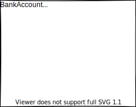
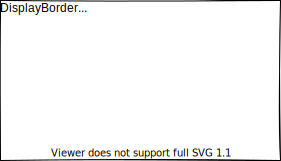
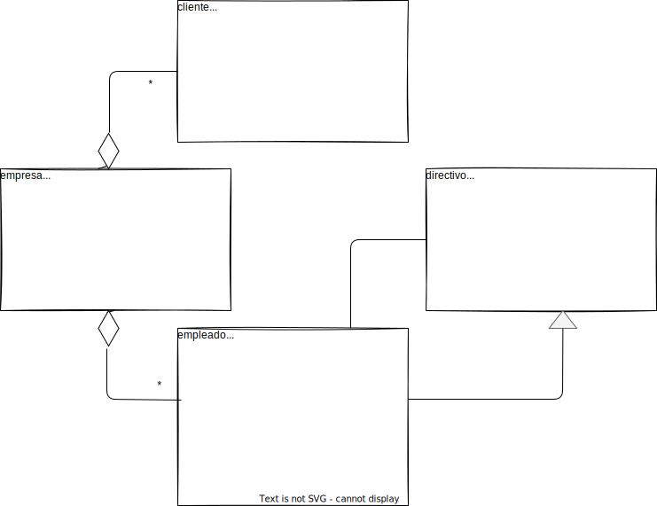
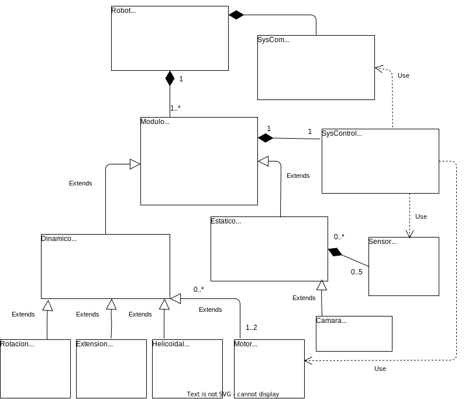

# Diagramas de clases con UML

## Ejemplos de diagramas de clases.

## 1. Diagrama de clase de un un banco.

## 2. Diagrama de clase del programa en Kotlin.

## 3. Gestión de clientes y Facturas.

## Tarea 1: Empleados de empesa

## Tarea 4: Robot Modular
